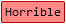
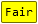

Sorting-Algorithms-Blender
==========================

Sorting algorithms visualized using the Blender Python API.

Table of contents
=================

<!--ts-->
   * [Introduction](#introduction)
      * [Description](#description)
      * [Getting Started](#getting-started)
      * [Limitations](#limitations)
      * [Possible Updates](#possible-updates)
   * [Sorting Algorithms](#sorting-algorithms)
      * [Bubble Sort](#bubble-sort)
      * [Insertion Sort](#insertion-sort)
      * [Selection Sort](#selection-sort)
      * [Heap Sort](#heap-sort)
      * [Shell Sort](#shell-sort)
      * [Merge Sort](#merge-sort)
      * [Quick Sort](#quick-sort)
   * [Big O](#big-o)
      * [What is Big O Notation?](#what-is-big-o-notation)
      * [Time Complexity Notations](#time-complexity-notations)
      * [Table of Sorting Algorithms](#table-of-sorting-algorithms)
      * [Big O Complexity Chart](#big-o-complexity-chart)
<!--te-->

Introduction
============
## Description
Running one of the scripts in this project generates primitive meshes in Blender, wich are animated to visualize various sorting algorithms. 
Keyframes are incrementaly inserted according to the current position of the element in the array during the sorting. 
The four folders <strong>(sort_circle, sort_color, sort_combined, sort_scale)</strong> contain four different types of visualization.

|Type|Sorting Criteria|Representation of Index|Extras|
|:--:|:--------------:|:---------------------:|:----:|
|<a href="https://github.com/ForeignGods/Sorting-Algorithms-Blender/blob/main/sort_circle" target="_blank">sort_circle|hsv of material|rotation of cuboid|hsv = 360°|
|<a href="https://github.com/ForeignGods/Sorting-Algorithms-Blender/blob/main/sort_color" target="_blank">sort_color|red + green of material|location of plane|custom color gradient|
|<a href="https://github.com/ForeignGods/Sorting-Algorithms-Blender/blob/main/sort_combined" target="_blank">sort_combined|red + green of material|location of plane|multiple 2d arrays arranged into a cube|
|<a href="https://github.com/ForeignGods/Sorting-Algorithms-Blender/blob/main/sort_scale" target="_blank">sort_scale</a>|scale of cubiod|location of cuboid|array access and  comparison counter|

## Getting Started

<ol>
<li>Download, install and start <a href="https://www.blender.org/">Blender<a>.</li>
<li>Open the .py file in the <a href="https://docs.blender.org/manual/en/latest/editors/text_editor.html"> Text Editor</a>.</li>
<li>Click the play button to run the script.</li>
</ol>

## Limitations
These visualizations don't show the efficiency of the algorithms. 
They only visualize movement of the elements within the array. 
But the array access and comparison counters are indicators of the time complexity of the algorithms. 
For more information about the time complexity, you can take a look at the [Big O Table](#table-of-sorting-algorithms). 

## Possible Updates

Below I compiled a list of features that could be implemented in the future. 
  
<ul> 
<li>increase efficiency of the setup_array() function, to allow greater object count</li>
 <li>adding audio <a href= "https://www.youtube.com/watch?v=kPRA0W1kECg&t=57s">"Audibilization"</a> </li>
<li>adding more sorting algorithms</li>
<li>adding more types of visualization e.g.
<a href="https://www.youtube.com/watch?v=_bxWi1sxRWA&t=194s">Sphere Agitation<a>, 
<a href="https://www.youtube.com/watch?v=ohn_NwAQZtE">Cube Amalgam<a>, 
<a href="https://www.youtube.com/watch?v=S0RtR2Yllzk">Dynamic Hoops<a></li>
<li>auto generate camera with correct transforms based on the count of sorted objects</li>
<li>create panel were you can choose different options like colors, sorting algorithms and count of objects</li>
<li>improve merge sort visualization so there are no gaps and overlapping objects</li>
</ul>

<strong>Contributions to this project with either ideas from the list or your own are welcome.</strong>

  
Sorting Algorithms
==================
  
|<a href="https://github.com/ForeignGods/Sorting-Algorithms-Blender/blob/main/sort_combined/combined_sort_cube.py" target="_blank">combined_sort_cube.py</a>|
| ------------- |
||
  

## Bubble Sort

Bubble sort is one of the most straightforward sorting algorithms, it makes multiple passes through a list. 
<ul>
<li>Starting with the first element, compare the current element with the next element of the array.</li>
<li>If the current element is greater than the next element of the array, swap them.</li>
<li>If the current element is less than the next element, move to the next element.</li>
</ul>
In essence, each item “bubbles” up to the location where it belongs.

| <a href="https://github.com/ForeignGods/Sorting-Algorithms-Blender/blob/main/sort_scale/bubble_sort_scale.py" target="_blank">bubble_sort_scale.py</a>|<a href="https://github.com/ForeignGods/Sorting-Algorithms-Blender/blob/main/sort_color/bubble_sort_color.py" target="_blank">bubble_sort_color.py</a>|<a href="https://github.com/ForeignGods/Sorting-Algorithms-Blender/blob/main/sort_circle/bubble_sort_color.py" target="_blank">bubble_sort_circle.py</a>|
| ------------- |-------------|------------|
||||

## Insertion Sort

Like bubble sort, the insertion sort algorithm is straightforward to implement and understand. 
<ul>
<li>Iterate from arr[1] to arr[n] over the array.</li>
<li>Compare the current element (key) to its predecessor.</li>
<li>If the key element is smaller than its predecessor, compare its elements before.</li>
<li>Move the greater elements one position up to make space for the swapped element.</li>
</ul>
It splits the given array into sorted and unsorted parts, 
then the values from the unsorted parts are picked and placed at the correct position in the sorted part.

| <a href="https://github.com/ForeignGods/Sorting-Algorithms-Blender/blob/main/sort_scale/insertion_sort_scale.py" target="_blank">insertion_sort_scale.py</a>|<a href="https://github.com/ForeignGods/Sorting-Algorithms-Blender/blob/main/sort_color/insertion_sort_color.py" target="_blank">insertion_sort_color.py</a>|
| ------------- |:-------------:| 
||| 

## Selection Sort

The algorithm maintains two subarrays in a given array.
<ul>
<li>The subarray which is already sorted.</li>
<li>Remaining subarray which is unsorted.</li>
</ul>

In every iteration of selection sort, the minimum element (considering ascending order) from the unsorted subarray is picked and moved to the sorted subarray.

|<a href="https://github.com/ForeignGods/Sorting-Algorithms-Blender/blob/main/sort_scale/selection_sort_scale.py" target="_blank">selection_sort_scale.py</a>|<a href="https://github.com/ForeignGods/Sorting-Algorithms-Blender/blob/main/sort_color/selection_sort_color.py" target="_blank">selection_sort_color.py</a>|<a href="https://github.com/ForeignGods/Sorting-Algorithms-Blender/blob/main/sort_circle/selection_sort_circle.py" target="_blank">selection_sort_circle.py</a>|
| ------------- |:-------------:|-------|
||||

## Heap Sort

Based on the binary heap data structure, heap sort is mainly considered as a comparison-based sorting algorithm. 
In this sorting technique, at first, the minimum element is found out and then the minimum element gets placed at its right position at the beginning of the array. 
For the rest of the elements, the same process gets repeated. 
So, we can say that heap sort is quite similar to the selection sort technique. 
Heap sort basically recursively performs two main operations:
<ul>
<li>Build a heap H, using the elements of array.</li>
<li>Repeatedly delete the root element of the heap formed in 1st phase.</li>
</ul>
  
|<a href="https://github.com/ForeignGods/Sorting-Algorithms-Blender/blob/main/sort_scale/heap_sort_scale.py" target="_blank">heap_sort_scale.py</a>|<a href="https://github.com/ForeignGods/Sorting-Algorithms-Blender/blob/main/sort_color/heap_sort_color.py" target="_blank">heap_sort_color.py</a>| 
| ------------- |:-------------:| 
|||   
 
## Shell Sort

The shell sort algorithm extends the insertion sort algorithm and is very efficient in sorting widely unsorted arrays. 
The array is divided into sub-arrays and then insertion sort is applied. 
The algorithm is:
<ul>
<li>Calculate the value of the gap.</li>
<li>Divide the array into these sub-arrays.</li>
<li>Apply the insertion sort.</li>
<li>Repeat this process until the complete list is sorted.</li>
</ul>
This sorting technique works by sorting elements in pairs, far away from each other and subsequently reduces their gap.  The gap is known as the interval. We can calculate this gap/interval with the help of Knuth’s formula.

|<a href="https://github.com/ForeignGods/Sorting-Algorithms-Blender/blob/main/sort_scale/shell_sort_scale.py" target="_blank">shell_sort_scale.py</a>|<a href="https://github.com/ForeignGods/Sorting-Algorithms-Blender/blob/main/sort_color/shell_sort_color.py" target="_blank">shell_sort_color.py</a>| 
| ------------- |:-------------:| 
||| 

## Merge Sort

Merge sort uses the divide and conquer approach to sort the elements. 
It is one of the most popular and efficient sorting algorithms. 

The sub-lists are divided again and again into halves until the list cannot be divided further. 
Then we combine the pair of one element lists into two-element lists, sorting them in the process. 
The sorted two-element pairs is merged into the four-element lists, and so on until we get the sorted list.

| <a href="https://github.com/ForeignGods/Sorting-Algorithms-Blender/blob/main/sort_scale/merge_sort_scale.py" target="_blank">merge_sort_scale.py</a>|<a href="https://github.com/ForeignGods/Sorting-Algorithms-Blender/blob/main/sort_color/merge_sort_color.py" target="_blank">merge_sort_color.py</a>|<a href="https://github.com/ForeignGods/Sorting-Algorithms-Blender/blob/main/sort_circle/merge_sort_circle.py" target="_blank">merge_sort_circle.py</a>|
| ------------- |:-------------:|------------|
||||

## Quick Sort

Like Merge Sort, Quick Sort is a Divide and Conquer algorithm. It picks an element as pivot and partitions the given array around the picked pivot. There are many different versions of Quick Sort that pick pivot in different ways. 
<ul>

<li>Always pick first element as pivot.</li>
<li>Always pick last element as pivot.</li>
<li>Pick a random element as pivot.</li>
<li>Pick median as pivot. (implemented below)</li>
</ul>

The key process in quickSort is <strong>partition()</strong>. Target of partitions is, given an array and an element x of array as pivot, put x at its correct position in sorted array and put all smaller elements (smaller than x) before x, and put all greater elements (greater than x) after x. 
All this should be done in linear time.

| <a href="https://github.com/ForeignGods/Sorting-Algorithms-Blender/blob/main/sort_scale/quick_sort_scale.py" target="_blank">quick_sort_scale.py</a>|<a href="https://github.com/ForeignGods/Sorting-Algorithms-Blender/blob/main/sort_color/quick_sort_color.py" target="_blank">quick_sort_color.py</a>|<a href="https://github.com/ForeignGods/Sorting-Algorithms-Blender/blob/main/sort_circle/quick_sort_circle.py" target="_blank">quick_sort_circle.py</a>|
| ------------- |:-------------:|--------|
||||

Big O
=====

### What is Big O Notation?

Big O notation is the language we use for talking about how long an algorithm takes to run. 
It's how we compare the efficiency of different approaches to a problem. 
With Big O notation we express the runtime in terms of **how quickly it grows relative to the input, as the input gets arbitrarily large.**

Let's break that down:
<ul>
<li><strong>how quickly the runtime grows</strong>

It's hard to pin down the exact runtime of an algorithm.  
It depends on the speed of the processor, what else the computer is running, etc. So instead of talking about the runtime directly, we use big O notation to talk about how quickly the runtime grows.</li>
    
<li><strong>relative to the input</strong>

If we were measuring our runtime directly, we could express our speed in seconds. 
Since we're measuring how quickly our runtime grows, we need to express our speed in terms of...something else. 
With Big O notation, we use the size of the input, which we call<strong> "n"</strong>. 
So we can say things like the runtime grows "on the order of the size of the input" <strong>(O(n))</strong> or "on the order of the square of the size of the input" <strong>(O(n^2))</strong>.</li>
    
<li><strong>as the input gets arbitrarily</strong>

Our algorithm may have steps that seem expensive when <strong>"n"</strong> is small but are eclipsed eventually by other steps as <strong>"n"</strong> gets huge.  
For big O analysis, we care most about the stuff that grows fastest as the input grows, because everything else is quickly eclipsed as <strong>"n"</strong> gets very large.</li>
</ul>

### Time Complexity Notations
 
These are the asymptotic notations that are used for calculating the time complexity of the sorting algorithms:
<ul>
<li><strong>Big O Notation, O:</strong></li>
  
It measures the upper limit of an algorithm's running time or the worst-case time complexity. It is known by O(n) for input size 'n'.

<li><strong>Omega Notation, Ω:</strong></li>

It measures the minimum time taken by algorithms to execute, and calculates the best case time complexity in sorting. It is known by Ω(n) for input size 'n'.

<li><strong>Theta Notation, θ:</strong></li>

It measures the average time taken by an algorithm to execute. Or, the lower bound and upper bound of an algorithm's running time. It is known by θ(n) for input size 'n'.
</ul>
  
### Table of Sorting Algorithms

In applications such as in radix sort, a bound on the maximum key value <strong>"k"</strong> will be known in advance, and can be assumed to be part of the input to the algorithm. 
However, if the value of <strong>"k"</strong> is not already known then it may be computed, as a first step, by an additional loop over the data to determine the maximum key value.   
  
<table>
    <tr>
      <th>Algorithm</th>
      <th colspan="3">Time Complexity</th>
      <th>Space Complexity</th>
    </tr>
    <tr>
      <th></th>
      <th>Best Case</th>
      <th>Average Case</th>
      <th>Worst Case</th>
      <th>Worst Case</th>
    </tr>
    <tr>
      <td><a href="http://en.wikipedia.org/wiki/Quicksort">Quick Sort</a></td>
      <td><code class="orange">Ω(n log(n))</code> </td>
      <td><code class="orange">Θ(n log(n))</code> </td>
      <td><code class="red">O(n^2)</code> </td>
      <td><code class="yellow-green">O(log(n))</code> </td>
    </tr>
    <tr>
      <td><a href="http://en.wikipedia.org/wiki/Merge_sort">Merge Sort</a></td>
      <td><code class="orange">Ω(n log(n))</code> </td>
      <td><code class="orange">Θ(n log(n))</code> </td>
      <td><code class="orange">O(n log(n))</code> </td>
      <td><code class="yellow">O(n)</code> </td>
    </tr>
    <tr>
      <td><a href="http://en.wikipedia.org/wiki/Timsort">Tim Sort</a></td>
      <td><code class="yellow">Ω(n)</code> </td>
      <td><code class="orange">Θ(n log(n))</code> </td>
      <td><code class="orange">O(n log(n))</code> </td>
      <td><code class="yellow">O(n)</code> </td>
    </tr>
    <tr>
      <td><a href="http://en.wikipedia.org/wiki/Heapsort">Heap Sort</a></td>
      <td><code class="orange">Ω(n log(n))</code> </td>
      <td><code class="orange">Θ(n log(n))</code> </td>
      <td><code class="orange">O(n log(n))</code> </td>
      <td><code class="green">O(1)</code> </td>
    </tr>
    <tr>
      <td><a href="http://en.wikipedia.org/wiki/Bubble_sort">Bubble Sort</a></td>
      <td><code class="yellow">Ω(n)</code> </td>
      <td><code class="red">Θ(n^2)</code> </td>
      <td><code class="red">O(n^2)</code> </td>
      <td><code class="green">O(1)</code> </td>
    </tr>
    <tr>
      <td><a href="http://en.wikipedia.org/wiki/Insertion_sort">Insertion Sort</a></td>
      <td><code class="yellow">Ω(n)</code> </td>
      <td><code class="red">Θ(n^2)</code> </td>
      <td><code class="red">O(n^2)</code> </td>
      <td><code class="green">O(1)</code> </td>
    </tr>
    <tr>
      <td><a href="http://en.wikipedia.org/wiki/Selection_sort">Selection Sort</a></td>
      <td><code class="red">Ω(n^2)</code> </td>
      <td><code class="red">Θ(n^2)</code> </td>
      <td><code class="red">O(n^2)</code> </td>
      <td><code class="green">O(1)</code> </td>
    </tr>
    <tr>
      <td><a href="https://en.wikipedia.org/wiki/Tree_sort">Tree Sort</a></td>
      <td><code class="orange">Ω(n log(n))</code> </td>
      <td><code class="orange">Θ(n log(n))</code> </td>
      <td><code class="red">O(n^2)</code> </td>
      <td><code class="yellow">O(n)</code> </td>
    </tr>
    <tr>
      <td><a href="http://en.wikipedia.org/wiki/Shellsort">Shell Sort</a></td>
      <td><code class="orange">Ω(n log(n))</code> </td>
      <td><code class="red">Θ(n(log(n))^2)</code> </td>
      <td><code class="red">O(n(log(n))^2)</code> </td>
      <td><code class="green">O(1)</code> </td>
    </tr>
    <tr>
      <td><a rel="tooltip" title="Only for integers. k is a number of buckets" href="http://en.wikipedia.org/wiki/Bucket_sort">Bucket Sort</a></td>
      <td><code class="green">Ω(n+k)</code> </td>
      <td><code class="green">Θ(n+k)</code> </td>
      <td><code class="red">O(n^2)</code> </td>
      <td><code class="yellow">O(n)</code> </td>
    </tr>
    <tr>
      <td><a rel="tooltip" title="Constant number of digits 'k'" href="http://en.wikipedia.org/wiki/Radix_sort">Radix Sort</a></td>
      <td><code class="green">Ω(nk)</code> </td>
      <td><code class="green">Θ(nk)</code> </td>
      <td><code class="green">O(nk)</code> </td>
      <td><code class="yellow">O(n+k)</code> </td>
    </tr>
    <tr>
      <td><a rel="tooltip" title="Difference between maximum and minimum number 'k'" href="https://en.wikipedia.org/wiki/Counting_sort">Counting Sort</a></td>
      <td><code class="green">Ω(n+k)</code> </td>
      <td><code class="green">Θ(n+k)</code> </td>
      <td><code class="green">O(n+k)</code> </td>
      <td><code class="yellow">O(k)</code> </td>
    </tr>
    <tr>
      <td><a href="https://en.wikipedia.org/wiki/Cubesort">Cube Sort</a></td>
      <td><code class="yellow">Ω(n)</code> </td>
      <td><code class="orange">Θ(n log(n))</code> </td>
      <td><code class="orange">O(n log(n))</code> </td>
      <td><code class="yellow">O(n)</code> </td>
   </tr>

</table>

### Big O Complexity Chart

